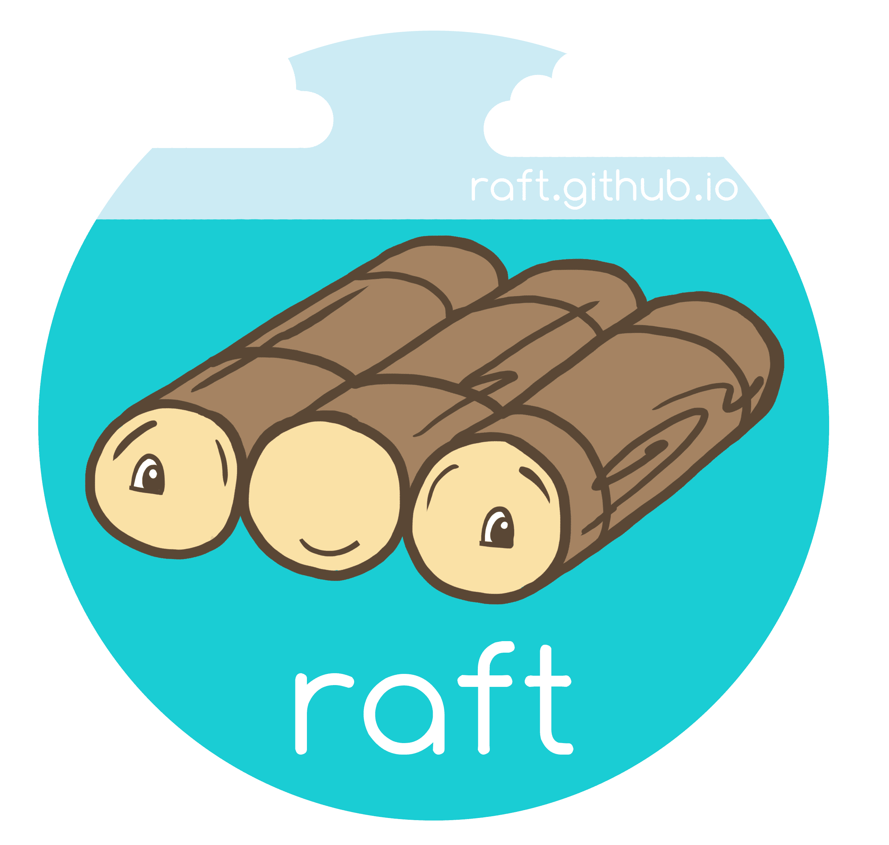

# Raft consensus algorithm logo/mascot

The original files [annie-solo.png](annie-solo.png) and
[annie-sticker.png](annie-sticker.png), were re-encoded using the OxiPNG
codec via https://squoosh.app, and are available under:

    Copyright 2015 Andrea Ruygt.
    Licensed under the Creative Commons Attribution-4.0 International
    License, available at https://creativecommons.org/licenses/by/4.0/

The files [solo.svg](solo.svg) and [sticker.svg](sticker.svg) are vectorized
versions based on Annie's original raster (PNG) files. The log raft and clouds
were traced automatically using Inkscape.  The sky was made slightly darker and
more blue to increase contrast with the "raft.github.io" text.  The font used
is v1.x of [Comfortaa](https://github.com/ongardie/Comfortaa/tree/master/v1.x)
(note that the *f* and *t* in 'raft' look different in v2.x).
`solo.svg` and `sticker.svg` are:

    Copyright 2015 Andrea Ruygt.
    Copyright 2015 Diego Ongaro.
    Licensed under the Creative Commons Attribution-4.0 International
    License, available at https://creativecommons.org/licenses/by/4.0/
